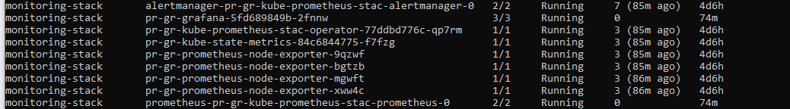

# Дипломный практикум в Yandex.Cloud

---
## Создание облачной инфраструктуры

1. Создание сервисного аккаунта с минимально-достаточными правами
   

1. Подготовить backend для Terraform
   ```
   terraform {
        required_providers {
            yandex = {
            source = "yandex-cloud/yandex"
                }
        }
    required_version = ">= 0.13"

    backend "s3" {
        endpoint   = "storage.yandexcloud.net"
        bucket     = "devops-diplom-yandexcloud"
        region     = "ru-central1"
        access_key = "SOME_KEY"
        secret_key = "SOME_SECRET"

        skip_region_validation      = true
        skip_credentials_validation = true
    }
    }
   ```
1. Настройка workspaces, использован workspace - prod
   
2. Создание VPC [prod/main.tf](prod/main.tf)
3. terraform apply - отрабатывает
4. Состояние сохраняется
    
---

## Создание Kubernetes кластера
1. Подготовлена конфигурация серверов [prod/main.tf](prod/main.tf) согласно запланированной архитектуре 
   
   
    Результат развертывания:
    

    Конфигурация для kubespray в каталоге [kubespray](kubespray)

    Вывод ``` kubectl get pods --all-namespaces ``` (после выполнения всех развертываний):
    

    Вывод ``` kubectl get nodes ```:

    
  ---
## Создание тестового приложения

1. Тестовое приложение - Web страница на Golang:  
   - Репозиторий [kocmoc1/simple-go-webapp](https://github.com/kocmoc1/simple-go-webapp) 
   - Docker - репозиторий [kocmoc1/sgw](https://hub.docker.com/repository/docker/kocmoc1/sgw)

---
## Подготовка cистемы мониторинга и деплой приложения

1. Выполнено развертывание с помощью helm, [файл значений](k8s-deploys/helm-val/monitoring.yaml)
    ```
    helm install pr-gr prometheus-community/kube-prometheus-stack -n monitoring-stack -f k8s-deploys/helm-val/monitoring.yaml
    ```
    Результат выполнения:
    

    Выполнена установка node-exporte на сервер reverse-proxy (Nginx) 
    

    Скриншоты мониторинга:
    
    
    
    
    
---
## Установка и настройка CI/CD

1. Установка выполняется provision-скриптом, им же происходит развертывание кластера K8s с помощью kubespray, [скрипт](jenkins/install_jenkins.sh)
    
    Web-интерфейс Jenkins c пайплайном сборки:
    

    

    Yaml развертывания приложения [sgw.yaml](https://github.com/kocmoc1/simple-go-webapp/blob/main/sgw.yaml)
    Скриншот развернутого приложения:
    
    

---
# Спасибо за внимание!